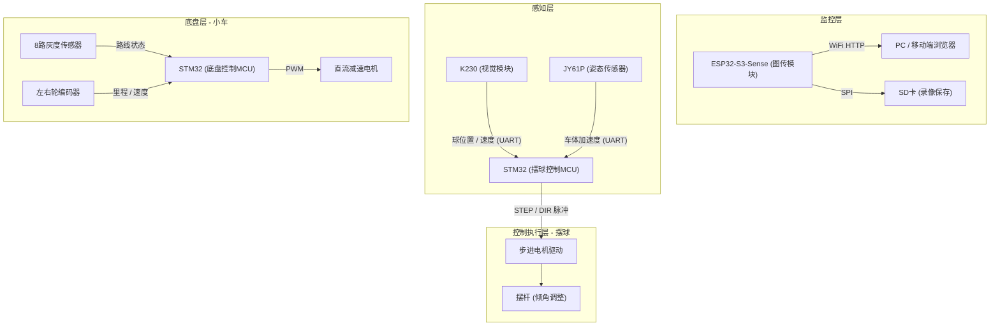

# 车载平衡滚球运动控制系统（2026 电赛 H 题）

## 📌 项目简介

本项目是针对 2026 年全国大学生电子设计竞赛 H 题（车载平衡滚球运动控制系统）设计的完整解决方案。系统要求在一辆能够沿黑色环形路线行驶的小车上，搭载一个能够控制摆杆角度的装置，使钢球在静止及小车运动过程中，均能保持在摆杆上的指定位置（如中心点或任意指定点）。

本系统采用了**“双MCU分工控制 + 视觉闭环”**的核心架构，实现了高动态、高精度的闭环控制。

## 🏗️ 系统架构

本项目的软硬件架构分为四大子系统，职责分明：



### 四大核心模块：
1. **K230 视觉检测模块**：高帧率（~90fps）检测钢球在摆杆上的 1D 位置与速度，将数据输出给摆球控制 MCU。
2. **ESP32 CAM 图传模块**：架设于摆杆上方，通过 WiFi 实时传输监控画面，支持浏览器本地录像及 SD 卡无损抓帧回放（对应题目图传及回放要求）。
3. **STM32 摆球控制核心**：通过接收视觉误差和车体前馈加速度，计算出摆杆目标角度，进而通过增量脉冲（STEP/DIR）控制步进电机，使钢球稳定。
4. **STM32 小车底盘控制**：负责灰度循迹、路程计算与车速控制，实现启动、跑圈和高精度定点停车。

---

## 📁 代码仓库结构

```text
平衡小球控制系统/
├── README.md                      ← 本总说明文档
├── 题目/
│   └── H题_车载平衡滚球运动控制系统.pdf
└── 代码/
    ├── K230代码/                  ← 视觉模块（MicroPython）
    │   ├── README.md
    │   └── main.py
    ├── ESP32 CAM代码/             ← 图传与录像模块（Arduino C++）
    │   ├── README.md
    │   └── camera.ino
    ├── 步进电机控制小球代码/      ← 摆球核心控制（STM32 + Keil）
    │   ├── README.md              ← 摆球控制原理与调试指南
    │   ├── User/
    │   ├── Hardware/
    │   └── ...
    └── 电赛小车控制代码/          ← 循迹底盘控制（STM32 + Keil）
        ├── README.md
        ├── User/
        ├── Hardware/
        └── ...
```

---

## 📊 题目任务与实现分析

根据题目要求，本项目实现了以下任务：

1. **摆球位置监测图传（第1项）**
   - **实现**：采用 ESP32-S3-Sense，开机建立 WiFi AP。PC/Pad 连接后，可通过浏览器查看实时 MJPEG 视频流，并支持点击录制（保存至浏览器或 SD 卡）。提供独立的 `/playback` 页面用于赛事查验回放。
2. **小车循迹与精准停车（第2项）**
   - **实现**：底盘 STM32 通过 8 路灰度传感器进行黑线 PID 循迹。通过“循迹标志位特征”结合“最短行驶时间（RunTime_ms）”防误触发，实现一圈后高精度识别 A 点起停线并进行缓停，确保误差 ≤ 2cm。
3. **静止状态下球位置动态控制（第3项：O → +5cm → -5cm）**
   - **实现**：摆球 STM32 中设计了独立的状态机（Task3）。设定目标依次为 +5cm 和 -5cm。控制中结合了**最低起步坡度（克服静摩擦）**与**目标切换时的位置 PID 重置**，保证 5s 内完成高动态响应并稳定。
4. **行驶中保持中心稳定（第4、5项）**
   - **实现**：小车跑圈时，车体加减速和过弯会产生扰动。摆球 MCU 引入了 JY61P 陀螺仪的**加速度前馈（Ax）**，在车体加速瞬间提前给出反向倾角补偿，配合**速度阻尼**和**PID 闭环**，将误差严格控制在 ±1cm 内。
5. **行驶中任意位置锁定（第6项）**
   - **实现**：利用按键（Key2）瞬间记录 K230 传来的当前坐标作为 Target。针对不同距离（近/中/远/边缘），算法自动分配不同强度的**最低锁定坡度**和**前馈系数**，确保在边缘大扰动下小球亦不脱落。

---

## ⚡ 快速上手

1. **环境准备**：
   - K230：MicroPython 环境（如 CanMV IDE）。
   - ESP32 CAM：Arduino IDE（需安装 ESP32 扩展包）。
   - STM32 (2块)：Keil MDK V5，ARM 编译器。
2. **烧录与部署**：
   - 分别进入四个子目录，阅读对应的 `README.md` 获取接线与烧录细节。
3. **操作流程**：
   - 小车置于 A 点，上电。
   - 等待底盘与摆杆初始化完成（摆杆归中）。
   - 按下摆球 MCU / 底盘 MCU 上的任务按键（对应第3/4/6项任务），系统即开始运行。

---

> **附**：每个代码子目录中均提供了详细的代码注释与子 `README.md`，深入研究算法请查阅各目录。
