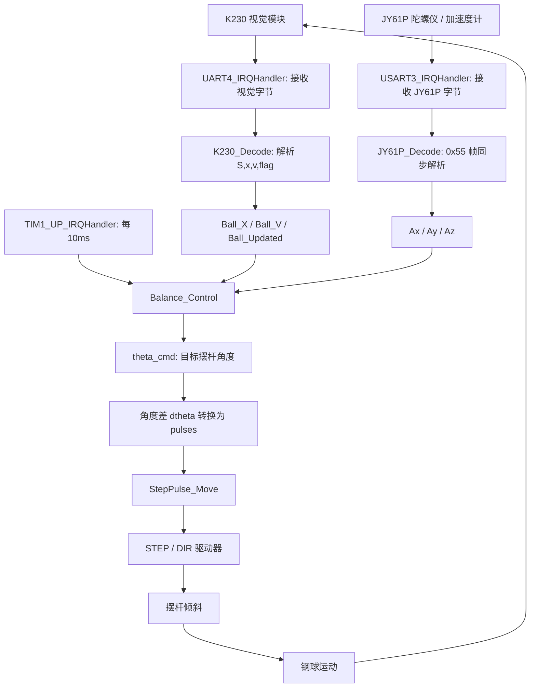
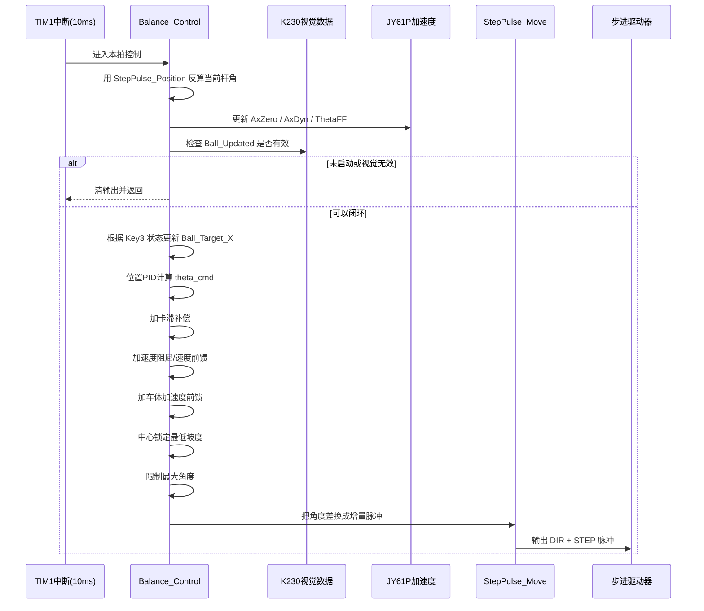
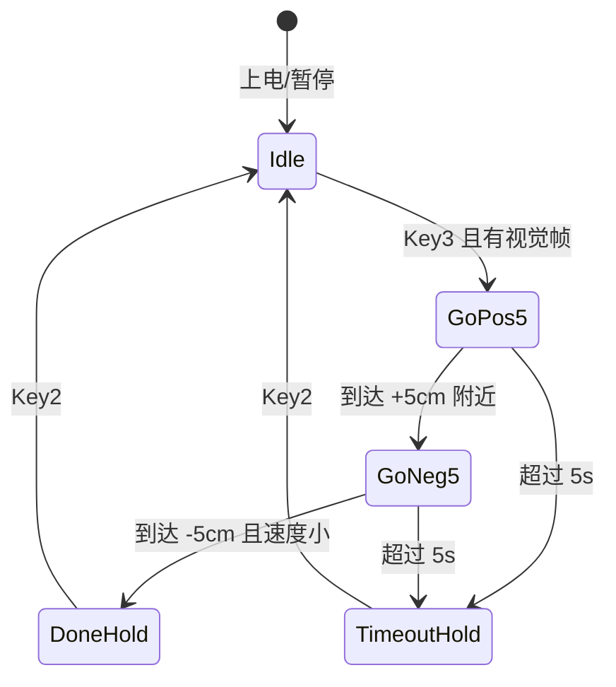
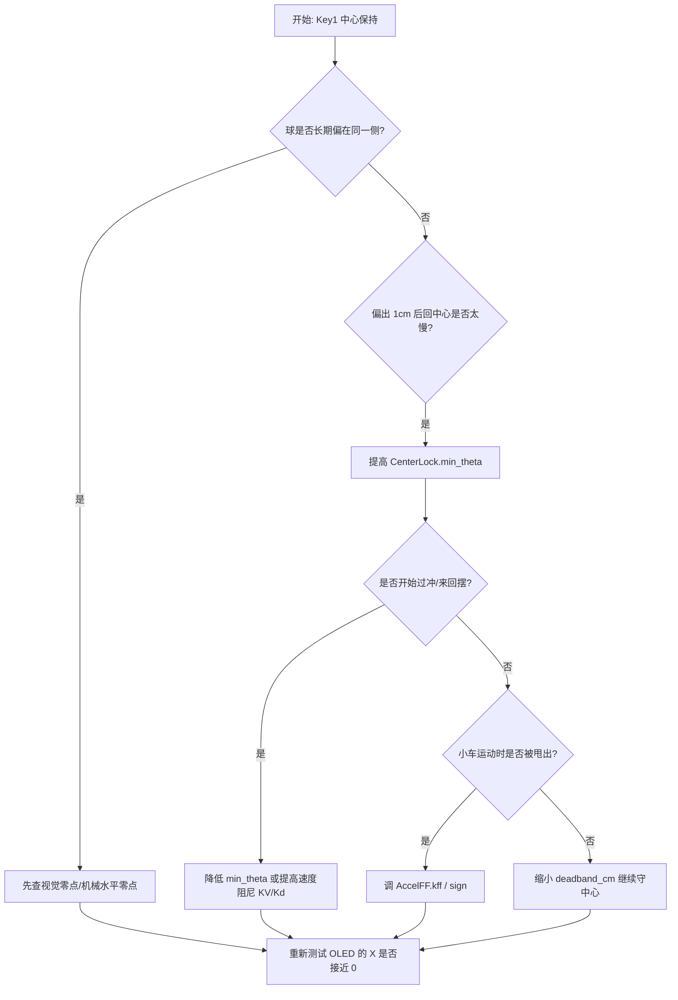
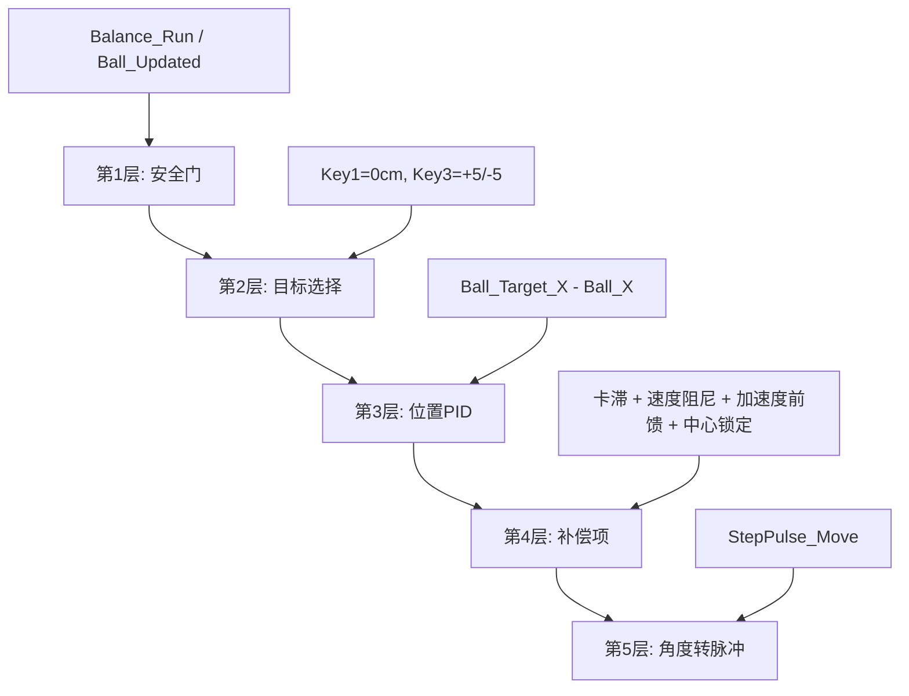

# 摆球中心锁定控制学习笔记

> 当前工程：`D:\Desk\26电赛730`  
> 主要代码：`Hardware/Balance.c`、`Hardware/K230.c`、`Hardware/usart.c`、`Hardware/step.c`、`User/main.c`  
> 目标：看懂现在这套“小球从任意位置回中心，并在小车行驶中稳定在中心附近”的控制链路。

## 一、先看项目中的真实痛点

这道题最变态的地方不是让小球“最终回到中心”，而是要求小车行驶过程中钢球稳定在摆杆中心点附近，误差绝对值小于等于 `1cm`。这意味着控制器不能等球偏出去很远才救，它要一直守住中心。

现在核心入口在 `D:\Desk\26电赛730\Hardware\Balance.c:453`：

```c
void Balance_Control(void)
{
    float theta_cmd, dtheta, ball_error;
    ...
    Step_Pulse_Current = StepPulse_Position;
    Step_Angle_Current = (float)StepPulse_Position / (BALANCE_DIR_SIGN * PULSES_PER_RAD);
    Balance_UpdateAccelFF((Balance_Run == 0) ? 1 : 0);

    if (!Balance_Run || !Ball_Updated)
    {
        Balance_PulseCmd = 0;
        Balance_ThetaCmd = 0.0f;
        ...
        return;
    }
```

这段代码已经能看出三个关键事实：

- 控制函数每 `10ms` 跑一次，不是主循环里随便跑。
- 没按启动键或 K230 没有有效视觉帧时，闭环直接退出，不发脉冲。
- 步进电机当前位置不是电机回传得到的，而是 `StepPulse_Position` 软件计数估计出来的。

所以这套系统不是简单的“PID 输出 PWM”。它更像这样：

```text
视觉位置/速度 + 车体加速度
        ↓
算出摆杆应该倾斜到多少角度 theta_cmd
        ↓
把目标角度和当前软件估计角度相减
        ↓
换成这一拍应该补多少个 STEP 脉冲
        ↓
通过 STEP/DIR 直接驱动步进电机
```

## 二、工程文件地图

| 文件 | 作用 | 你主要看哪里 |
| --- | --- | --- |
| `D:\Desk\26电赛730\User\main.c` | 初始化、按键、OLED、10ms 中断入口 | `main.c:30`、`main.c:42`、`main.c:101` |
| `D:\Desk\26电赛730\Hardware\K230.c` | 解析视觉模块发来的球位置和球速度 | `K230.c:41`、`K230.c:83` |
| `D:\Desk\26电赛730\Hardware\usart.c` | 解析 JY61P 加速度、串口中断 | `usart.c:124`、`usart.c:199`、`usart.c:332` |
| `D:\Desk\26电赛730\Hardware\Balance.c` | 摆球闭环控制核心 | `Balance.c:453` |
| `D:\Desk\26电赛730\Hardware\step.c` | STEP/DIR 脉冲输出和软件位置计数 | `step.c:81` |
| `D:\Desk\26电赛730\Hardware\PID.c` | 通用 PID 计算函数 | `PID.c:24` |

## 三、控制总流程



你可以把它理解成一个闭环：

- K230 告诉 STM32：球现在在哪、正在往哪滚。
- JY61P 告诉 STM32：车体现在有没有加速/减速扰动。
- STM32 算：杆该抬多少角度。
- 步进电机执行：把杆推到这个角度附近。
- 球动了以后，K230 下一帧又反馈回来。

## 四、一次 10ms 控制拍里发生了什么

`User/main.c:101` 是 TIM1 中断，里面每 `10ms` 调一次 `Balance_Control()`：

```c
void TIM1_UP_IRQHandler(void)
{
    ...
    if (Balance_DebugActive)
    {
        Balance_StepperDebugTick();
    }
    else
    {
        Balance_Control();
    }
    ...
}
```

更细一点的时序如下：



## 五、为什么不是只调 PID 三个参数

你之前问过：“为什么不能统一成 PID 三个参数？”这个问题问得非常对。答案是：如果系统很线性，当然最好就是 PID；但这个题的机械系统不是线性的。

真实问题至少有四种：

| 问题 | PID 的困难 | 现在代码里的处理 |
| --- | --- | --- |
| 静摩擦/轨道局部卡滞 | 小误差时 PID 输出太小，球不动 | `Ball_StuckBias` 卡滞补偿 |
| 小车加速/减速 | PID 看到球偏了才反应，已经晚了 | `Balance_ThetaFF` 加速度前馈 |
| 视觉速度噪声 | 速度太小时会乱抖 | `V_DEAD` 速度死区 |
| 题目要求 ±1cm | 不能等偏差大了再动 | `CenterLock.min_theta` 中心锁定最低坡度 |

所以当前方案不是“PID 很烂所以不用 PID”，而是：

```text
PID 负责基础回零趋势
补偿项负责处理 PID 不擅长的非线性问题
限幅负责保护机械和电机
```

## 六、控制量是怎么合成的

核心变量：

```text
Ball_Target_X：目标位置，中心保持时为 0cm
Ball_X：视觉测到的小球位置，右正左负
Ball_V：视觉测到的小球速度，右正左负
Ax：JY61P 原始 X 轴加速度
Balance_AxDyn：扣零偏后的动态加速度
Balance_ThetaCmd：最终目标摆杆角度
Balance_PulseCmd：本拍要输出的增量脉冲
```

### 1. 位置 PID

位置 PID 参数在 `D:\Desk\26电赛730\Hardware\Balance.c:172`：

```c
static PID_Init BallPID = {0.02f, 0.0f, 0.5f, 0, 0, 0, 0, 0, 0, 20.0f, THETA_MAX};
```

PID 计算在 `D:\Desk\26电赛730\Hardware\PID.c:24`：

```c
pid->error = pid->Target - actual;
pid->derivative = pid->error - pid->last_error;
pid->output = pid->Kp * pid->error +
              pid->Ki * pid->integral +
              pid->Kd * pid->derivative;
```

这里的 PID 输出不是 PWM，也不是脉冲数，而是“目标摆杆角度”。

例如中心保持：

```text
Ball_Target_X = 0
Ball_X = +2cm
ball_error = 0 - 2 = -2cm
控制器应该给负向坡度，让球往中心滚回来
```

### 2. 卡滞补偿

卡滞补偿是给“球卡住不动”的情况准备的。判断条件大概是：

```text
位置误差还在
速度很小
误差没有继续变小
持续一段时间
```

满足后，代码会逐步增加 `Ball_StuckBias`，方向始终指向目标点。

它解决的是这个现场现象：

```text
PID 明明已经给了坡度
但球就是停在 -2cm 或 +2cm 不动
```

注意，这不是把零点判成“速度为 0”。速度为 0 只表示“可能卡住”，零点仍然看视觉位置 `Ball_X`。

> 踩坑提醒：卡滞补偿太大时，球一旦突破静摩擦，会带着额外坡度冲过中心。所以它必须有上限和释放速度。

### 3. 速度阻尼

速度阻尼在 `Balance_Control()` 中通过 `Ball_V` 加入：

```text
theta_cmd += -KV * Ball_V
```

直觉是：球滚得太快时，不要继续猛推，要开始刹车。否则小球会穿过中心后继续飞出去。

| 现象 | 可能调哪里 |
| --- | --- |
| 过中心很多、左右来回摆 | 增大 `KV` 或 PID 的 `Kd` |
| 回中心太慢、还没到就刹太早 | 减小 `KV` 或提高 `V_DEAD` |

### 4. 加速度前馈

加速度前馈参数在 `D:\Desk\26电赛730\Hardware\Balance.c:116`：

```c
static const BalanceAccelFFParam AccelFF = {
    0.08f,   // kff
    0.060f,  // theta_max
    0.03f,   // dead_g
    0.20f,   // filter_alpha
    0.02f,   // zero_alpha
    1        // sign
};
```

它的计算入口在 `D:\Desk\26电赛730\Hardware\Balance.c:179`：

```text
Balance_AxDyn = Ax - Balance_AxZero
Balance_ThetaFF = sign * kff * Balance_AxDyn
```

为什么要扣 `AxZero`？因为 JY61P 静止时 `Ax` 不一定是 0，安装角度、重力分量、传感器零偏都会混进去。你之前观察到静止也可能是 `1` 左右，所以不能直接把 raw `Ax` 当加速度扰动。

前馈的作用是提前防守：

```text
小车刚加速 -> 球还没明显偏 -> PID 还没大动作
加速度前馈先抬杆 -> 抵消惯性扰动
```

> 踩坑提醒：如果前馈方向反了，车一加速球会更容易跑偏。先改 `AccelFF.sign`，不要同时乱改 PID 和机械方向宏。

### 5. 中心锁定最低坡度

中心锁定参数在 `D:\Desk\26电赛730\Hardware\Balance.c:125`：

```c
static const BalanceCenterLockParam CenterLock = {
    0.120f,  // theta_max
    0.20f,   // deadband_cm
    0.110f,  // min_theta
    2.0f     // release_v
};
```

这就是现在冲 `±1cm` 最关键的部分。

普通 PID 的特点是误差越小，输出越小。但题目要求 `|误差| <= 1cm`，小误差区反而最重要。如果球已经偏到 `0.8cm`，控制器不能摆烂，它要立刻守住。

中心锁定做的事是：

```text
如果目标是 0cm
并且小球离中心超过 deadband_cm
并且球还没有明显朝中心滚动
那就至少给 min_theta 这么大的坡度
```

所以你把某个值调到 `0.090f` 后响应明显变快，大概率就是这个 `min_theta` 或类似最低坡度参数开始跨过静摩擦阈值了。

## 七、最终角度怎么变成步进脉冲

步进脉冲输出在 `D:\Desk\26电赛730\Hardware\step.c:81`：

```c
void StepPulse_Move(int32_t pulses)
{
    ...
    StepPulse_SetDir(dir);
    for (i = 0; i < n; i++)
    {
        GPIO_SetBits(STEP_PULSE_GPIO, STEP_PULSE_PIN);
        StepPulse_Delay();
        GPIO_ResetBits(STEP_PULSE_GPIO, STEP_PULSE_PIN);
        StepPulse_Delay();
    }
    StepPulse_Position += pulses;
}
```

`Balance_Control()` 最后做的是：

```text
目标杆角 theta_cmd
当前估计杆角 Step_Angle_Current
角度差 dtheta = theta_cmd - Step_Angle_Current
本拍脉冲 pulses = dtheta * PULSES_PER_RAD
限幅到 STEP_PULSE_PER_TICK
调用 StepPulse_Move(pulses)
```

这里有两个限幅很重要：

| 限幅 | 作用 |
| --- | --- |
| `theta_cmd` 角度限幅 | 防止杆抬太大、撞限位、堵转 |
| `STEP_PULSE_PER_TICK` 每拍脉冲限幅 | 防止电机瞬间跑太快、丢步或抖动 |

> 踩坑提醒：`StepPulse_Position` 是软件估计。如果电机实际丢步、皮带打滑、机械撞限位，这个数不会自动知道自己错了。所以调试时一定要保留软件限位，不要为了“更猛”直接删保护。

## 八、按键和题目模式

按键逻辑在 `D:\Desk\26电赛730\User\main.c:42` 开始：

| 按键 | 当前作用 |
| --- | --- |
| Key1 | 普通中心保持模式，目标 `0cm` |
| Key2 | 暂停闭环，退出第3项 |
| Key3 | 题目第3项，小车静止，小球 `O -> +5cm -> -5cm` |

第3项状态机入口在 `D:\Desk\26电赛730\Hardware\Balance.c:242`，状态更新在 `D:\Desk\26电赛730\Hardware\Balance.c:268`。



中心保持模式比第3项更难，因为第3项是小车静止；中心保持要面对车体运动带来的扰动。

## 九、OLED 上每一行怎么看

OLED 显示在 `D:\Desk\26电赛730\User\main.c:82`：

```text
X: 小球位置 cm，右正左负
V: 小球速度 cm/s，右正左负
Ax: JY61P 原始 X 轴加速度
D: 扣零偏后的动态加速度 Balance_AxDyn
FF: 加速度前馈输出角度 Balance_ThetaFF
T: 最终控制角度 Balance_ThetaCmd
J: JY61P 有效帧计数后三位
Q3: 第3项状态
```

调试时建议这样看：

| 观察 | 说明 |
| --- | --- |
| `X` 长期偏在同一侧 1-2cm | 可能是视觉零点/机械水平零点偏了，或中心最低坡度不够 |
| `V` 经常是 0 但 `X` 不在 0 | 静摩擦/卡滞明显，需要最低坡度或 kick |
| `D` 车动时有变化 | JY61P 动态加速度可用 |
| `FF` 车一动就同向变化 | 前馈正在参与控制 |
| 车一加速球更飞 | 优先反转 `AccelFF.sign` |
| `T` 经常顶到上限 | 控制器已经尽力，可能需要更大角度上限或机械改进 |

## 十、冲 ±1cm 的调参路线

现在题目要求是中心误差绝对值 `<=1cm`，建议按这个顺序调，不要同时改一堆：



推荐理解这些参数的分工：

| 参数 | 负责什么 | 太小 | 太大 |
| --- | --- | --- | --- |
| `CenterLock.min_theta` | 球偏出中心后的最低拉回坡度 | 卡在 ±1-2cm | 过冲、抖动 |
| `CenterLock.deadband_cm` | 认为“已经足够中心”的范围 | 频繁细抖 | 太早放松，守不住 1cm |
| `CenterLock.theta_max` | 中心保持时最大允许坡度 | 大偏差拉不回来 | 电机冲、撞限位风险 |
| `KV` | 根据球速刹车 | 容易冲过中心 | 回来太慢 |
| `AccelFF.kff` | 小车加速扰动提前补偿 | 车动时球先飞再救 | 车一动就过度反向推 |
| `AccelFF.sign` | 前馈方向 | 方向错就越补越坏 | 只有 `1/-1` 两种，错了就换 |

一个比较稳的调试顺序：

1. 小车不启动，只用 Key1，把球从 `+2cm/-2cm` 手动扰动，看能不能回到 `±1cm` 内。
2. 如果回不来，先加 `CenterLock.min_theta`。
3. 如果能回但过冲，先降 `min_theta` 或加一点速度阻尼。
4. 静止能守住后，再让小车低速跑，看车加速/减速瞬间球怎么偏。
5. 如果车动瞬间明显偏，才调 `AccelFF.kff` 和 `AccelFF.sign`。
6. 如果始终偏同一边，不要只加控制量，要检查视觉 `0cm` 是否真是摆杆中心。

## 十一、零点到底是什么

当前系统里的零点不是“球速度为 0”，也不是“开机时球在哪就把哪当零点”。

当前零点定义是：

```text
K230 视觉算法输出的 Ball_X = 0cm
```

也就是说，真正的中心来自视觉标定。如果 OLED 上显示 `X = +2.0`，程序就认为球在中心右侧 2cm。哪怕球不动，程序也不会认为它在零点。

但这里有一个现实问题：如果视觉标定的 `0cm` 和机械摆杆中心不一致，程序会很认真地把球拉到一个“视觉上的 0”，结果你肉眼看可能不在机械中心。反过来也一样。

> 踩坑提醒：冲 `±1cm` 前，一定要确认 K230 显示的 `0cm` 就是题目尺子量出来的中心 O。否则控制调得越猛，只是越快地回到错误的零点。

## 十二、你应该怎么读这套代码

建议按这个顺序读，不要一上来就扎进所有宏：

1. 读 `D:\Desk\26电赛730\User\main.c:30`，看初始化顺序。
2. 读 `D:\Desk\26电赛730\User\main.c:42`，看三个按键分别怎么切模式。
3. 读 `D:\Desk\26电赛730\User\main.c:101`，确认控制每 `10ms` 进入一次。
4. 读 `D:\Desk\26电赛730\Hardware\K230.c:41`，看 `Ball_X / Ball_V / Ball_Updated` 怎么来。
5. 读 `D:\Desk\26电赛730\Hardware\Balance.c:453`，先只看大流程，不纠结每个参数。
6. 读 `D:\Desk\26电赛730\Hardware\step.c:81`，看最后怎么发脉冲。
7. 最后再回头看 `Balance.c` 顶部那几组参数，每次只理解一组。

你可以把 `Balance.c` 看成五层：



## 十三、现在最该继续学习的两个问题

第一，为什么 `min_theta` 一加，响应会明显变快？

因为它跨过了静摩擦门槛。PID 输出可能只有一点点坡度，理论上球该动，但真实球不动。最低坡度相当于告诉系统：只要球偏出中心，就至少给一个能推动球的坡度。

第二，为什么小车运动后还是会偏 1-2cm？

可能有三类原因：

- 静态守不住：`CenterLock.min_theta` 不够，或死区太大。
- 动态被甩出：`AccelFF.kff` 不够，或 `AccelFF.sign` 反了。
- 零点有偏：视觉 `0cm` 和机械中心不一致。

调参时先分清这三类，否则容易出现“越调越不知道自己在调什么”。

## 十四、一句话总结

这套系统的核心不是“PID 三个参数”，而是：

```text
用视觉位置定义零点，用 PID 给回零趋势，用最低坡度突破静摩擦，
用速度阻尼刹过冲，用加速度前馈提前抗小车扰动，
最后把目标角度转换成 STEP/DIR 脉冲去推摆杆。
```

当你能在 OLED 上同时解释 `X / V / D / FF / T` 的变化时，你就基本看懂这套控制了。
