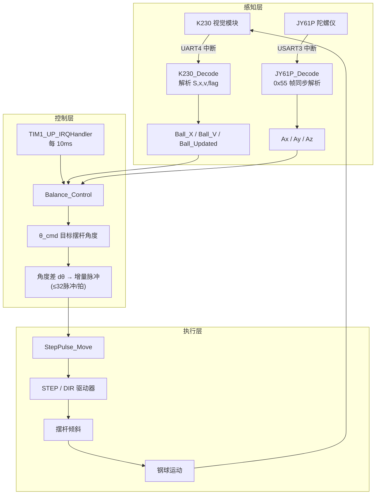
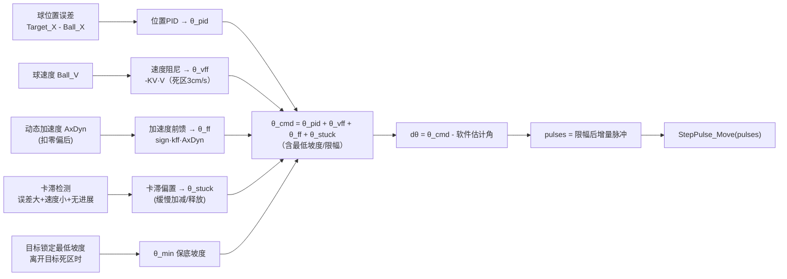

# 26电赛730 —— 摆球中心锁定控制（STM32F103VET6）

> 电赛题目第 730 号工程：**小车摆杆钢球稳定控制**
> 核心任务：钢球在摆杆上任意位置**稳定锁定**（误差 ≤ 1cm），并在小车行驶过程中保持不脱落、不偏移。

---

## 📑 目录

- [一、项目简介](#一项目简介)
- [二、题目要求与解决思路](#二题目要求与解决思路)
- [三、硬件架构](#三硬件架构)
  - [3.1 主控与传感器](#31-主控与传感器)
  - [3.2 引脚分配总表](#32-引脚分配总表)
  - [3.3 串口资源分配](#33-串口资源分配)
- [四、通信协议](#四通信协议)
  - [4.1 K230 视觉模块协议（UART4）](#41-k230-视觉模块协议uart4)
  - [4.2 JY61P 陀螺仪协议（USART3）](#42-jy61p-陀螺仪协议usart3)
- [五、软件架构](#五软件架构)
  - [5.1 文件地图](#51-文件地图)
  - [5.2 系统控制流程图](#52-系统控制流程图)
  - [5.3 10ms 中断执行时序](#53-10ms-中断执行时序)
- [六、摆球闭环控制算法详解（核心）](#六摆球闭环控制算法详解核心)
  - [6.1 控制链路总览](#61-控制链路总览)
  - [6.2 位置 PID](#62-位置-pid)
  - [6.3 速度前馈（阻尼）](#63-速度前馈阻尼)
  - [6.4 加速度前馈（开环预补偿）](#64-加速度前馈开环预补偿)
  - [6.5 卡滞补偿（静摩擦脱困）](#65-卡滞补偿静摩擦脱困)
  - [6.6 目标点锁定最低坡度](#66-目标点锁定最低坡度)
  - [6.7 角度 → 增量脉冲](#67-角度--增量脉冲)
  - [6.8 控制量合成公式](#68-控制量合成公式)
- [七、任务模式与按键操作](#七任务模式与按键操作)
  - [7.1 Key1 —— 普通中心保持](#71-key1--普通中心保持)
  - [7.2 Key2 —— 第 6 项：任意指定位置锁定](#72-key2--第-6-项任意指定位置锁定)
  - [7.3 Key3 —— 第 3 项：O → +5cm → -5cm](#73-key3--第-3-项o--5cm---5cm)
  - [7.4 备用：步进电机自检](#74-备用步进电机自检)
- [八、OLED 调试信息](#八oled-调试信息)
- [九、调参指南](#九调参指南)
  - [9.1 参数位置速查](#91-参数位置速查)
  - [9.2 建议调参顺序](#92-建议调参顺序)
  - [9.3 常见现象与对策](#93-常见现象与对策)
- [十、构建与烧录](#十构建与烧录)
- [十一、安全保护机制](#十一安全保护机制)
- [十二、已知问题与注意事项](#十二已知问题与注意事项)
- [十三、开发日志](#十三开发日志)

---

## 一、项目简介

本项目是一个基于 **STM32F103VET6** 的电赛小车系统。小车底盘上装有一根可绕轴旋转的摆杆，摆杆上放置一颗钢球。系统需要通过 **视觉 + 惯性传感 + 步进电机闭环控制**，实现：

1. 钢球从任意位置自动回到摆杆中心 O 点，并稳定保持（误差 ≤ 1cm）；
2. 小车行驶过程中（加减速、转弯），钢球始终稳定在中心/指定位置附近；
3. 支持题目第 3 项（O → +5cm → -5cm 往返）与第 6 项（任意指定位置锁定）的自动流程。

**控制方案核心**：不是简单的"PID 输出 PWM"，而是——

```text
视觉球位置/速度 + 车体加速度
        ↓
算出摆杆应该倾斜到的目标角度 θ_cmd
        ↓
目标角度与软件估计角度之差 → 增量 STEP 脉冲
        ↓
STEP/DIR 直接驱动步进电机 → 摆杆倾斜 → 钢球运动
```

---

## 二、题目要求与解决思路

| 题目项 | 要求 | 本工程实现 |
| --- | --- | --- |
| 第 3 项 | 小车静止，球从 O 出发 → +5cm → 折返 → -5cm 稳定，5s 内 | `Balance_Task3*` 状态机（Key3 触发） |
| 第 4/5 项 | 球稳定在中心 O，误差 ≤ 1cm | 普通中心保持模式（Key1 触发） |
| 第 6 项 | 球置于**任意指定位置**，小车跑圈后球仍稳定 | `Balance_Task6*` 任意点锁定（Key2 触发） |

**核心难点**：小车行驶时钢球会被加速度扰动甩离目标点，且摆杆轨道存在静摩擦、局部坡度等非线性因素。控制器不能等球偏出去很远才救，必须**一直守住目标点**。

---

## 三、硬件架构

### 3.1 主控与传感器

| 器件 | 型号/说明 | 作用 |
| --- | --- | --- |
| 主控 MCU | STM32F103VET6（High-density） | 控制中枢 |
| 视觉模块 | 嘉楠 K230 | 检测钢球位置/速度，ASCII 串口输出 |
| 陀螺仪 | JY61P（WitMotion 维特） | 输出三轴加速度/角速度/角度 |
| 摆杆驱动 | 张大头闭环步进电机 + 驱动器 | STEP/DIR 脉冲控制摆杆倾角 |
| 车轮电机 | 直流减速电机 ×2 + 编码器 | 小车行走（另一 MCU 主控） |
| 循迹 | 8 路灰度传感器 | 黑线循迹检测 |
| 显示 | OLED (I2C/SPI) | 实时调试数据显示 |
| 按键 | 3 个（PC1/PC2/PC3） | 任务模式切换 |
| 其他 | LED、蜂鸣器 | 状态指示 |

> ⚠️ **双 MCU 架构**：本工程 STM32 主要负责**摆球闭环**；循迹/车轮/电机通常由另一个 MCU 主控。灰度数据本机也读取（`Read_Track_DATA`），Key3 模式下可用 `Track_Control_AB` 驱动本机车轮。

### 3.2 引脚分配总表

| 功能 | 引脚 | 说明 |
| --- | --- | --- |
| **步进 STEP** | PC12 | PUL/STEP 脉冲输出（推挽） |
| **步进 DIR** | PD2 | 方向电平输出 |
| K230 视觉 | PC10=TX / PC11=RX（UART4） | 115200bps |
| JY61P 陀螺仪 | PB10=TX / PB11=RX（USART3） | 115200bps |
| 调试串口 | PA9=TX / PA10=RX（USART1） | 9600bps，printf 输出 |
| 按键 | PC1 / PC2 / PC3 | 上拉输入 |
| 灰度传感器 | PE7=DAT / PE8=SCL | 8 路移位读入 |
| 编码器 | 左右轮编码器（TIM 计数） | 测速 |
| 电机 PWM | TIM 输出（PWM_L / PWM_R） | 3600 限幅 |
| NRF24L01（旧） | PA4/PA5/PC4/PC5/PB0 | 预留，当前未使用 |

> 引脚宏定义集中在各模块头文件（`step.h`、`usart.c`、`Track.c` 等），改接线只需改宏。

### 3.3 串口资源分配

| 串口 | 波特率 | 连接对象 | 用途 | 中断优先级 |
| --- | --- | --- | --- | --- |
| **UART4** | 115200 | K230 视觉 | 接收球位置/速度帧 | 抢占 1 / 响应 1 |
| **USART3** | 115200 | JY61P 陀螺仪 | 接收加速度/角速度/角度帧 | 抢占 3 / 响应 3 |
| **USART1** | 9600 | 调试口（PC） | printf 输出加速度调试 | 仅发送 |
| UART5（已停用） | - | 张大头串口（旧方案） | 电机串口协议（被 STEP/DIR 替代） | - |

> **重要**：`main.c` 中不再调用 `uart5_init()`，PC12/PD2 已改由 `StepPulse_Init()` 配置为 STEP/DIR 普通 GPIO，避免引脚复用冲突。

---

## 四、通信协议

### 4.1 K230 视觉模块协议（UART4）

ASCII 文本行协议，每帧以 `\n` 或 `\r` 结尾：

```
S,<X cm>,<V cm/s>,<flag>\n
```

| 字段 | 含义 |
| --- | --- |
| `S` | 帧起始标志 |
| `X` | 球相对中心位置（cm，**右正左负**） |
| `V` | 球速度（cm/s，右正左负） |
| `flag` | `1`=检测到球；`0`=丢失（速度强制置 0） |

示例：

```text
S,12.34,3.50,1\n     ← 球在右侧 12.34cm，向右移动 3.5cm/s
S,-5.12,-2.10,1\n    ← 球在左侧 5.12cm，向左移动
S,0.00,0.00,0\n      ← 丢失帧（速度清零，防止持续驱动）
```

**解析实现**（`Hardware/K230.c`）：
- 行缓冲 `line_buf[24]`，从 `'S'` 开始接收，遇换行结束；
- 轻量 `k230_atof()` 手写浮点解析（不依赖浮点 sscanf）；
- `flag=1` 时更新 `Ball_X / Ball_V` 并置 `Ball_Updated=1`；
- `flag=0` 时 `Ball_V=0`、`Ball_Updated=0`（**保持上次位置不更新**，防跳变）。

### 4.2 JY61P 陀螺仪协议（USART3）

维特标准帧，固定 **11 字节**：

```text
0x55 + 类型(0x51/0x52/0x53) + 8字节数据 + 校验和(前10字节累加和)
```

| 类型 | 数据内容 | 量程换算 |
| --- | --- | --- |
| `0x51` | 加速度 Ax/Ay/Az | `值/32768 × 16` (g) |
| `0x52` | 角速度 Wx/Wy/Wz | `值/32768 × 2000` (°/s) |
| `0x53` | 角度 Roll/Pitch/Yaw | `值/32768 × 180` (°) |

**解析实现**（`Hardware/usart.c`）：
- 以 `0x55` 帧头同步（避免丢字节后持续错位）；
- 第二字节校验类型合法（0x51/0x52/0x53），否则重新同步；
- 校验和通过才更新全局变量 `Ax/Ay/Az` 等，并递增 `JY61P_FrameCount`。

---

## 五、软件架构

### 5.1 文件地图

```
26电赛730/
├── README.md                    ← 本文件
├── Project.uvprojx              ← Keil 工程文件
├── User/
│   ├── main.c                   ← 主循环 + TIM1 10ms 中断（控制总入口）
│   ├── stm32f10x_it.c           ← 中断服务
│   └── stm32f10x_conf.h
├── Hardware/                    ← 硬件驱动 + 控制算法
│   ├── Balance.c / Balance.h    ← ★ 摆球闭环控制核心
│   ├── step.c / step.h          ← STEP/DIR 脉冲输出 + 软件位置限位
│   ├── K230.c / K230.h          ← 视觉帧解析
│   ├── usart.c / usart.h        ← 串口初始化 + JY61P 解析
│   ├── PID.c / PID.h            ← 通用 PID（抗积分饱和）
│   ├── Track.c / Track.h        ← 灰度循迹读取（8 路）
│   ├── Motor.c / Motor.h        ← 电机方向 + SetPWM
│   ├── Encoder.c / Encoder.h    ← 编码器测速
│   ├── PWM.c / PWM.h            ← 电机 PWM 输出
│   ├── OLED.c / OLED.h          ← OLED 显示（含 OLED_Printf）
│   ├── Key.c / Key.h            ← 按键消抖扫描
│   ├── LED.c / Buzzer.c         ← 指示灯/蜂鸣器
│   ├── magnet.c / step.c        ← 电磁铁（备用）/ 步进
│   └── NRF24L01.c               ← 无线模块（预留）
├── Track/
│   ├── Track.c / Track.h        ← 循迹 PID（距离环+速度环+循迹环）
│   └── (Track_Control_AB / Track_Control_loop)
├── System/
│   ├── sys.c / sys.h            ← SYS_Init 总初始化 + 引脚总览注释
│   ├── Timer.c / Timer.h        ← TIM1 10ms 定时中断配置
│   └── delay.c / delay.h        ← 延时
├── Library/                     ← 标准外设库（STM32F10x）
├── Start/                       ← 启动文件 + 内核头文件
├── Docs/
│   └── 摆球中心锁定控制学习笔记.md  ← 控制原理学习笔记（推荐阅读）
└── Objects/ / Listings/         ← 编译产物
```

### 5.2 系统控制流程图



### 5.3 10ms 中断执行时序

`TIM1` 配置：72MHz / 720 分频 / 1000 计数 = **10ms 一次更新中断**（`System/Timer.c`）。

`User/main.c` 中的中断服务函数每拍执行：

```c
void TIM1_UP_IRQHandler(void)
{
    Key_Tick();                    // 1. 按键消抖扫描
    Encoder_Read();                // 2. 编码器读数
    Read_Track_DATA(&Track);       // 3. 灰度读线
    Track_Control();               // 4. 循迹偏差计算
    if (Balance_DebugActive)
        Balance_StepperDebugTick(); // 5a. 步进自检（调试模式）
    else
        Balance_Control();          // 5b. 摆球闭环控制（正常模式）
    if (!Balance_DebugActive && KeyNum == 3)
        Track_Control_AB(Target_Location);  // 6. 第3项模式车轮按距离闭环
}
```

---

## 六、摆球闭环控制算法详解（核心）

> 全部代码在 `Hardware/Balance.c`，10ms 一拍，入口 `Balance_Control()`。

### 6.1 控制链路总览



### 6.2 位置 PID

```c
static PID_Init BallPID = {0.02f, 0.0f, 0.5f, ...};  // Kp=0.02, Ki=0, Kd=0.5
```

| 项 | 值 | 说明 |
| --- | --- | --- |
| Kp | 0.02 rad/cm | 球偏差 → 目标倾角 |
| Ki | 0 | 刻意关闭！积分容易把杆慢慢顶到一边 |
| Kd | 0.5 | 对误差微分，抑制过冲 |
| 输出限幅 | THETA_MAX = 0.08 rad | 软件机械保护 |

**注意**：PID 输出的是**目标摆杆角度**（rad），不是脉冲、不是 PWM。由 `PID.c` 的 `PID_Calculate()` 计算，含**抗积分饱和**（条件积分：输出撞限且误差同向时冻结积分）。

### 6.3 速度前馈（阻尼）

```c
#define KV (0.02f)     // 阻尼系数
#define V_DEAD (3.0f)  // 速度死区 cm/s
#define VFF_MAX (0.08f) // 最大贡献角度

if (|Ball_V| > V_DEAD)
    θ_cmd += clamp(-KV * Ball_V, ±VFF_MAX);
```

- 球向目标快冲时，此项抵消位置项 → 减小倾斜，防冲过中心；
- 球冲过头反向时，此项反向加力 → 拉回；
- 速度死区过滤视觉速度噪声（低速时不参与）。

### 6.4 加速度前馈（开环预补偿）

**目的**：小车加减速时，PID 看到球偏了才反应已经晚了。用 JY61P 的加速度**提前**给一个反向倾角补偿。

```c
ax_dyn = Ax - AxZero;                     // 扣安装姿态零偏
Balance_AxDyn += filter_alpha * (ax_dyn - Balance_AxDyn);  // 低通滤波
if (|AxDyn| < dead_g) θ_ff = 0;
else θ_ff = clamp(sign * kff * AxDyn, ±theta_max);
```

| 关键点 | 说明 |
| --- | --- |
| 零偏学习 | 停车（闭环未启动）时慢速更新 `AxZero`；启动后冻结 |
| 死区 | 0.03g，过滤静止噪声 |
| 分档 | 第 6 项按目标距离分 **近/中/远/边缘 4 档**，越远前馈越强（0.16 → 0.30 kff） |
| 方向 | `CenterAccelFF.sign = 1`，若方向反了改 -1 |

### 6.5 卡滞补偿（静摩擦脱困）

**现象**：球被静摩擦/轨道浅坑卡住，小误差时 PID 输出角度太小推不动。

**判定条件**（同时满足）：
1. 误差超出中心死区（> 0.35cm）；
2. 球速 < 0.8cm/s（STUCK_V_DEAD）；
3. 误差没有明显减小（本拍减小 < 0.04cm）；
4. 连续 15 拍（150ms）。

**动作**：朝目标方向每 10ms 增加 0.007 rad 偏置坡度，上限 0.055 rad。

**释放**：球一旦动起来（速度 > 1.5cm/s 或误差开始减小），每拍衰减 0.001 rad 缓慢退出，避免刚脱困就冲过中心；**误差符号翻转时立即清零**。

### 6.6 目标点锁定最低坡度

普通模式（第 4/5 项）与第 6 项任意点模式，只要球离开目标死区且没有明显朝目标运动，就强制给一个**朝目标方向的最低坡度** `min_theta`：

| 模式 | 死区 (cm) | min_theta (rad) | theta_max (rad) |
| --- | --- | --- | --- |
| 中心锁定（第4/5项） | 0.20 | 0.110 | 0.120 |
| 第6项近 (|target|<2cm) | 0.18 | 0.120 | 0.140 |
| 第6项中 (2~5cm) | 0.16 | 0.140 | 0.165 |
| 第6项远 (5~9cm) | 0.15 | 0.165 | 0.200 |
| 第6项边缘 (≥9cm) | 0.14 | 0.190 | 0.230 |

### 6.7 角度 → 增量脉冲

```c
STEP_PULSES_PER_REV = 3200   // 16细分
PULSES_PER_RAD = 3200 / 2π ≈ 509.3 脉冲/弧度
STEP_PULSE_PER_TICK = 32     // 每10ms最多32脉冲（杆角速度保护）
STEP_PULSE_ABS_LIMIT = 300   // 软件位置限位（约±34°）

dtheta = θ_cmd - Step_Angle_Current;      // 目标角 - 软件估计角
pulses = BALANCE_DIR_SIGN * dtheta * PULSES_PER_RAD;
pulses = clamp(pulses, ±32);              // 速度保护
StepPulse_Move(pulses);                   // 逐个输出 STEP 脉冲
```

**关键认知**：步进电机**没有位置反馈**，杆角是 `StepPulse_Position`（软件累计脉冲）估计的。若丢步/皮带打滑，估计值会漂移——这是本系统最大的不确定性来源。

### 6.8 控制量合成公式

```
θ_cmd = PID(球位置误差)                       // 基础回零
      + clamp(-KV·Ball_V, ±0.08)             // 速度阻尼（|V|>3 时）
      + θ_ff(加速度前馈)                       // 车体扰动预补偿
      + Ball_StuckBias                        // 卡滞脱困偏置
      + [最低坡度保底 / 第3项定向起步补偿]        // 非线性保底
      → 限幅 ±theta_pos/neg_limit
```

---

## 七、任务模式与按键操作

### 7.1 Key1 —— 普通中心保持

- 目标 `Ball_Target_X = 0`（中心 O）；
- **有视觉有效帧**（`Ball_Updated=1`）才允许闭环启动，防止开机/视觉未就绪时盲动；
- 同时退出第 3/6 项流程。

### 7.2 Key2 —— 第 6 项：任意指定位置锁定

题目：球置于摆杆**任意指定位置**并保持，小车跑圈。

- 按下瞬间记录当前视觉位置 `Balance_Task6Target = Ball_X` 为目标点；
- 状态机：`1`(原地锁球 0.5s) → `2`(持续锁定，可发车) → `3`(跑完保持)；
- **循迹/车轮由另一个 MCU 主控**，本 MCU 只负责锁球；
- 目标越远，自动启用更强的锁定坡度/前馈档位。

### 7.3 Key3 —— 第 3 项：O → +5cm → -5cm

状态机（5s 超时保护）：

| 状态 | 阶段 | 目标 | 切换条件 |
| --- | --- | --- | --- |
| 0 | 空闲 | - | - |
| 1 | 去 +5cm | +5 | 连续 1 拍进入 ±1cm 内 → 折返 |
| 2 | 折返去 -5cm | -5 | 位置 ±1cm 内 **且** 速度 ≤ 3.2cm/s，连续 20 拍 → 完成 |
| 3 | 完成保持 | -5 | 继续闭环保持（方便评委读误差） |
| 4 | 超时 | -5 | 500 拍（5s）未完成，仍保持 -5cm |

特色补偿：
- `fast_theta_max = 0.150`：临时放大角度上限冲时间；
- 去 +5 时给正向最低坡度 0.160（克服正向静摩擦）；
- 折返给负向最低坡度 0.180；
- 到 -5 后给保持坡度 0.270（防回滚）；
- 目标切换时**重置 PID 历史误差**，防微分冲击。

### 7.4 备用：步进电机自检

`Balance_StepperDebugStart()` 触发固定序列：`enable + zero → +50脉冲 → -50脉冲 → stop`。

- 正常现象：摆杆轻轻动一下，停 1s，再反向回去；OLED 显示 P: 0 → 50 → 0；
- 无反应时优先查：驱动供电、PUL/DIR 接线、共地、脉冲电平、细分设置。

---

## 八、OLED 调试信息

主循环每 50ms 刷新（`OLED_Printf`）：

| 行 | 内容 | 含义 |
| --- | --- | --- |
| 第 1 行 | `X:%.1f V:%.1f` | 球位置(cm) / 球速度(cm/s) |
| 第 2 行 | `Ax:%.2f D:%.2f` | JY61P 原始 Ax / 扣零偏后动态值 |
| 第 3 行 | `FF:%.2f T:%.2f` | 加速度前馈坡度 / 最终目标坡度 |
| 第 4 行 | `J%03lu Q3:%d Q6:%d` | 有效视觉帧数 / 第3项状态 / 第6项状态 |

另通过 USART1 每 50ms 输出 `AX:xx AY:xx AZ:xx` 供上位机观察。

---

## 九、调参指南

### 9.1 参数位置速查

| 参数 | 位置 | 作用 |
| --- | --- | --- |
| `BALANCE_DIR_SIGN` | Balance.c 顶部 | 方向符号（球越推越远时改） |
| `THETA_MAX` | Balance.c | 普通模式最大倾角 0.08 rad |
| `KV` / `V_DEAD` / `VFF_MAX` | Balance.c | 速度阻尼 |
| `CENTER_DEADBAND_CM` | Balance.c | 中心死区 0.35cm |
| `STUCK_*` 系列 | Balance.c | 卡滞补偿参数 |
| `BallPID` (Kp/Kd) | Balance.c | 位置 PID |
| `CenterAccelFF` / `Task6AccelFF*` | Balance.c | 加速度前馈分档 |
| `CenterLock` / `Task6Lock*` | Balance.c | 目标锁定最低坡度 |
| `Task3Profile` / `Task3Comp` | Balance.c | 第 3 项流程/补偿 |
| `STEP_PULSE_PER_TICK` | step.h | 每拍最大脉冲（杆速保护） |
| `STEP_PULSE_ABS_LIMIT` | step.h | 软件位置限位 |

### 9.2 建议调参顺序

1. **确认方向**：`BALANCE_DIR_SIGN`，球在右边 → 杆应向让球回左的方向倾斜；反了先改这个，**不要同时改它和 STEP_DIR_POS_LEVEL**；
2. **只加 Kp**：让球能往中心回（Kp 从 0.02 起）；
3. **加 Kd / KV**：抑制来回振荡过冲；
4. **处理停点**：优先调 `STUCK_*`，最后才考虑开 Ki；
5. **处理小车扰动**：调 `kff`（先 0.16），方向不对改 sign；
6. **第 3 项冲时间**：调 `fast_theta_max`、`pos/neg_theta_min`、`kick_v_dead`；
7. **第 6 项边缘**：调 `Task6LockEdge` / `Task6AccelFFEdge`。

### 9.3 常见现象与对策

| 现象 | 可能原因 | 对策 |
| --- | --- | --- |
| 球不回中心/越推越远 | 方向反了 | 改 `BALANCE_DIR_SIGN` |
| 来回振荡 | Kd/KV 不足 | 增大 Kd 或 KV |
| 某些位置停住不动 | 静摩擦/浅坑 | 调 `STUCK_*`（加大 step/max） |
| 小车加速时球被甩出 | 前馈不够/方向反 | 调 `kff`、`sign`、`theta_max` |
| 去 +5 卡住、去 -5 很快 | 机械不对称 | 调 `Task3Comp.pos_theta_min` |
| 到 -5 后回滚 | 保持坡度不够 | 调 `final_hold_theta_min` |
| 电机抖/堵转 | 每拍脉冲太多 | 减小 `STEP_PULSE_PER_TICK` |
| 电机不动 | 供电/接线/共地 | 用步进自检模式排查 |

---

## 十、构建与烧录

1. 使用 **Keil MDK5** 打开 `Project.uvprojx`（工程名 "Target 1"）；
2. 编译：**Build**（F7）；
3. 烧录：**Download**（F8），调试器配置见 `DebugConfig/`；
4. 也可通过 VS Code + EIDE 插件执行 `build` / `flash` / `build and flash` 任务（见 `Project.code-workspace`）。

**上电流程**：
1. 上电 → `SYS_Init()` 初始化全部外设，TIM1 先关闭；
2. `uart4_init()` 开 K230 串口、`Balance_Init()`（步进零点清零、零偏采样）；
3. 打开 TIM1（10ms 控制中断）→ 进入主循环；
4. **手动把摆杆放水平/中位**（上电时 `StepPulse_Zero()` 以当前机械位置为 0）；
5. 确认 K230 有帧（OLED 第 4 行 J 计数递增）→ 按 Key1/2/3 选择任务。

---

## 十一、安全保护机制

| 保护 | 实现 | 位置 |
| --- | --- | --- |
| 无视觉帧不发脉冲 | `!Ball_Updated` 直接 return | Balance.c |
| 未启动不发脉冲 | `!Balance_Run` 直接 return | Balance.c |
| 软件位置限位 | `STEP_PULSE_ABS_LIMIT = 300` 裁剪脉冲 | step.c |
| 杆速保护 | `STEP_PULSE_PER_TICK = 32` 每拍限幅 | Balance.c |
| 角度限幅 | `THETA_MAX` / 任务分档上限 | Balance.c |
| 积分抗饱和 | 条件积分冻结 | PID.c |
| 目标切换防冲击 | 重置 PID 历史误差 | Balance.c |
| 丢失帧速度清零 | flag=0 时 Ball_V=0 | K230.c |

---

## 十二、已知问题与注意事项

1. **步进无真实位置反馈**：软件角度估计可能因丢步/打滑漂移，调试期务必保留软件限位；
2. **零偏依赖停车学习**：上电后让车静止片刻再启动闭环，`AxZero` 才准确；
3. **旧代码残留**：`Objects/` 中 `car_fsm.c`、`gray_detection.c`、`mpu6050.c` 为历史重构残留（工程已改用 K230+JY61P 方案），不影响构建；
4. **双 MCU 协同**：第 6 项发车/循迹由另一 MCU 负责，两板间完成信号尚未接（`Balance_Task6Finish()` 已预留）；
5. **K230 零点校准**：第 3 项的 +5/-5 直接使用视觉坐标，**务必保证 K230 零点就是摆杆中心 O**；
6. **按键与自检**：Key3 当前绑定第 3 项流程，步进自检仅保留为备用接口（`Balance_StepperDebugStart()`）；
7. **调试口波特率**：USART1 为 9600bps（printf 输出），上位机需匹配。

---

## 十三、开发日志

| 日期 | 内容 |
| --- | --- |
| 早期 | 张大头串口运动模式（位置/速度/快速位置）→ 调试困难，弃用 |
| 重构 | 改为 STEP/DIR 普通脉冲控制，STM32 软件计数估计角度 |
| 迭代 | 增加加速度前馈（零偏学习 + 低通 + 死区） |
| 迭代 | 增加卡滞补偿（方向性偏置坡度，缓慢增减） |
| 迭代 | 增加目标锁定最低坡度（中心 + 任意点分档） |
| 迭代 | 实现第 3 项状态机（O→+5→-5，5s 超时） |
| 迭代 | 实现第 6 项任意点锁定（近/中/远/边缘分档） |
| 当前 | 现场调参阶段（参数集中在 Balance.c 顶部宏与结构体） |

---

## 📚 推荐阅读

- `Docs/摆球中心锁定控制学习笔记.md` —— 控制原理详细推导与现场调参心得（与本文互补，更偏原理）
